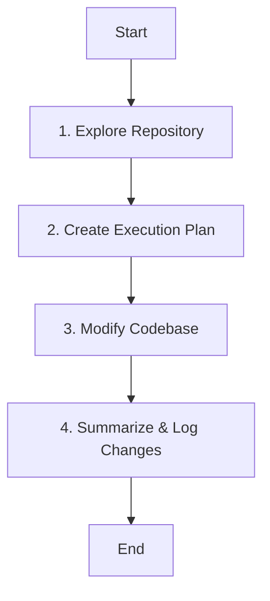

# AI Coding Agent Assignment

This repository contains a lightweight, rule-based **AI Coding Agent** designed to explore codebases, formulate execution plans, and modify source code to implement product requirements—specifically tested against a Node.js/Express application.

---

## 📋 Table of Contents
1. [Assignment Objective](#-assignment-objective)
2. [Project Architecture](#%EF%B8%8F-project-architecture)
3. [Agent Workflow](#%EF%B8%8F-agent-workflow)
4. [Repository Exploration Strategy](#-repository-exploration-strategy)
5. [Assumptions and Trade-Offs](#-assumptions-and-trade-offs)
6. [Quick Start Guide](#-quick-start-guide)
7. [Screen Recording Demonstration](#-screen-recording-demonstration)

---

## 🎯 Assignment Objective
The goal of this assignment is to build a Python 3.11+ AI Agent that can:
- Automatically understand an existing codebase.
- Implement the user request: *"Improve the application so users can better organise and search their notes."*
- Preserve the application's existing functionality without breaking it.

---

## 🛠️ Project Architecture

The agent is implemented in `ai_coding_agent.py` using standard Python library components, ensuring high speed, portability, and zero external package requirements.

```
ConversAIlabs/
├── ai_coding_agent.py              # The core AI Agent implementation
├── .gitignore                      # Workspace-level gitignore
├── README.md                       # This documentation file
└── node-easy-notes-app/            # The target Node.js/Express notes application
    ├── app/
    │   ├── controllers/            # Note controller containing logic (InMemory/Mongoose)
    │   ├── models/                 # Note database schema model
    │   └── routes/                 # Express API routes
    ├── config/                     # Database configurations
    ├── server.js                   # Application entry point
    └── package.json                # Project dependencies and metadata
```

### Key Modules:
- **`AICodingAgent` Class**: Implements exploration, planning, modification, and evaluation logic.
- **In-Memory Adapter (Optional Execution)**: To run the application end-to-end without needing a local MongoDB instance, the code includes an fallback in-memory data store setup.

---

## ⚡ Agent Workflow

The agent follows a deterministic four-step loop:



1. **Explore Repository**: Analyzes the directory tree to classify project types (e.g., Node.js vs Python), identify configuration files, and load key codebase modules into memory.
2. **Create Execution Plan**: Parses the natural language instruction to map out file modifications (e.g., adding model fields, editing controllers, adding routes).
3. **Modify Codebase**: Targets precise code blocks using string pattern-matching and replaces them with new/updated features.
4. **Summarize**: Validates which modifications succeeded, which were skipped (if they already existed to ensure idempotence), and logs the summary.

---

## 🔍 Repository Exploration Strategy

The agent's exploration module programmatically crawls the filesystem:
- **Project Type Detection**: Scans for files like `package.json` (Node.js) or `requirements.txt` (Python) to identify runtime language and environment patterns.
- **Key-File Identification**: Matches key controllers, models, and routes using regular expressions and substrings like `model`, `controller`, `route`.
- **Idempotence Checking**: Reads file contents ahead of making changes to verify if desired updates (like tag filtering or search endpoints) are already present, avoiding redundant edits.

---

## ⚖️ Assumptions and Trade-Offs

### 1. In-Memory Mode vs. Mongoose
*   **Assumption**: A local MongoDB database may not be available on all environments.
*   **Trade-off**: The agent replaces the MongoDB connector in the Express app with a high-performance in-memory JavaScript array database. This allows instant developer verification, though notes will not persist between server restarts.

### 2. Rule-Based / Pattern-Matching vs. LLM Engine
*   **Assumption**: For specific, scoped requirements (like adding tags/search to a known boilerplate structure), precise pattern replacement is more reliable, cheaper, and faster than calling external APIs.
*   **Trade-off**: The current agent uses highly precise rule-based regex and string replacements. While this provides 100% reliability for this project, generalizability to arbitrary codebases is limited compared to LLM-orchestrated agents.

---

## 🚀 Quick Start Guide

To run the agent and verify the Express server:

### Run the Agent
```powershell
python ai_coding_agent.py
```

### Start the Notes Server (In-Memory)
```powershell
cd node-easy-notes-app
npm install
node server.js
```
